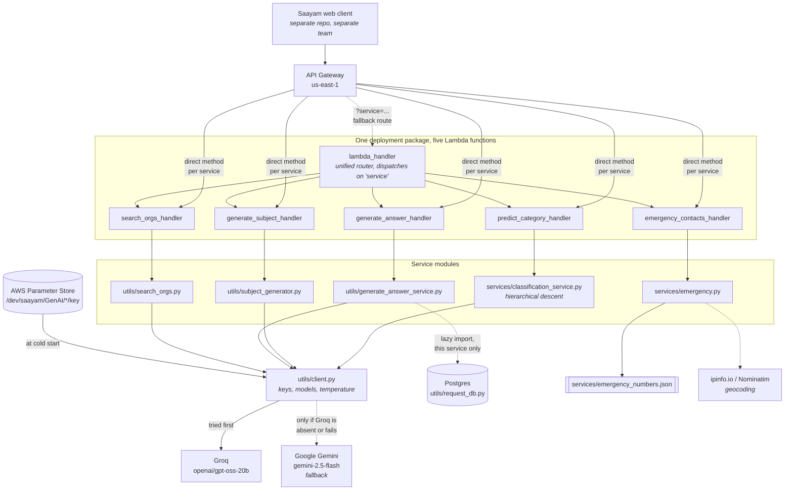

# The GenAI service, mapped

Read this between Mission 2 and Mission 3. It is the joiner-facing map: enough
of the shape of the system to know where your change goes and what it can
break. The team-facing architecture document is tracked separately in
[#153](https://github.com/saayam-for-all/ai/issues/153); when that lands, this
page should link to it rather than repeat it.

Everything below describes the `dev` branch. This file is tracked on the
`NewJoineeTask` lineage with the rest of the onboarding material, so read it
from GitHub or carry it across the way Mission 2 carries the self check.

---

## 1. How a request travels



Two things in that diagram are worth pausing on.

**The dotted Groq → Gemini edge is the subject of Mission 3.** It is a
*silent* fallback. When Groq is unavailable the code moves to Gemini without
telling anyone, and when Gemini is unavailable too, `classification_service`
returns an empty list rather than an error. The web client turns an empty list
into `General`. So a total provider outage renders in the browser as mildly
poor categorisation, which is why nobody noticed for weeks.

**The dotted `generate_answer` → Postgres edge is lazy on purpose.**
`utils/request_db.py` imports `psycopg2`, a compiled C extension. It used to be
imported at module scope in `lambda_function.py`, which meant a psycopg2 wheel
built for the wrong Python minor version failed the whole module and took
`predict_category`, `generate_subject`, `emergency_contacts` and `search_orgs`
down with it, before a single line of handler code ran. Only
`generate_answer` needs the database, so only it pays for it. The import is
inside `_lookup_request`, and `tests/test_import_blast_radius.py` exists to
stop anyone moving it back out.

---

## 2. Who owns what

"Where do I change this?" in one lookup.

| Service | Handler in `lambda_function.py` | Core module(s) | Notes |
| --- | --- | --- | --- |
| Predict Category | `predict_category_handler` | `services/classification_service.py`, `utils/predict_category_list.py`, `utils/categories*.py`, `utils/routing_for_categories.py` | Walks the taxonomy level by level; one model call per level |
| Generate Subject | `generate_subject_handler` | `utils/subject_generator.py` | Groq, then Gemini, then a truncated description |
| Generate Answer | `generate_answer_handler` | `utils/generate_answer_service.py`, `utils/__init__.py`, `utils/prompts*.py`, `utils/request_db.py` | The only service that touches Postgres |
| Emergency Contacts | `emergency_contacts_handler` | `services/emergency.py`, `services/emergency_numbers.json` | No model call at all; a dataset lookup plus geocoding |
| More Organizations | `search_orgs_handler` | `utils/search_orgs.py` | Raises `OrganizationSearchError` when every provider fails |

Emergency Contacts is the odd one out twice over: it makes no model call, and
it is the one method behind **Lambda proxy integration**, because its page
sends latitude and longitude from browser geolocation and proxy is the only
integration that passes query parameters and the caller IP through to the
function. Proxy integration requires `body` to be a JSON **string**; the other
four are non-proxy and return `body` as an **object**, because the web client
reads `response.body.categories` and `response.body.subject` directly. Serialise
the body on a non-proxy method and every one of those reads silently becomes
`undefined`. That is what `_response` and `_proxy_response` are for, and
`tests/test_response_contract.py` is what stops the two being swapped.

---

## 3. Two hosting paradigms, and why both exist

The same package is deployed **five times**, once per function. Look at the
deploy matrix in `.github/workflows/deploy_aws_lambda.yml`: five entries,
identical except for the Lambda ARN they read from a secret. Each API Gateway
method points at its own function and calls its own handler directly.

`lambda_handler` is the other paradigm: one entry point that reads a `service`
selector out of the query string or the body and dispatches to one of the five
handlers itself. It exists as a fallback route and for hand-run test events,
and it is genuinely useful for that — you can exercise every service from one
function without five sets of credentials.

**The independent model is the one we recommend and the one production uses.**
The reasons are ordinary operational ones: a per-function timeout (Generate
Answer needs 120 seconds; Predict Category does not), per-function metrics and
logs that mean something, and a blast radius of one when a function is
misconfigured. The router deliberately gives up almost none of that, because
all five handlers already live in one package anyway — but a single entry point
means one throttle limit and one CloudWatch log group for all five.

The trap: the router is *also* the reason the blast-radius problem in section 1
was so severe. One package, one import graph, five services. Independent
deployment does not buy independent failure if a shared module fails at import.

---

## 4. Where things fail

Keyed to the layers in the diagram, and worth reading before Mission 3 rather
than after.

| Layer | Failure | What it looks like | What guards it now |
| --- | --- | --- | --- |
| Provider | Model retired by Groq (`model_not_found`) | Every model-backed service degrades at once | `GROQ_MODEL` is one constant in `utils/client.py`; `tests/test_client_imports.py` |
| Provider | Outage or regional block | Groq fails, Gemini answers, nobody is told | Nothing yet. This is the open automatic-fallback ticket |
| Client | No key in Parameter Store | `_use_groq` stays `False`, and every call takes the fallback path | `INIT LOG` lines at cold start, which are only visible if someone reads CloudWatch |
| Service | Taxonomy descent returns nothing | `predict_categories` returns `[]` | `tests/test_classification_resilience.py` |
| Boundary | UI substitutes `General` for an empty result | An outage renders as mild misclassification | Not fixable in this repo. It is the web client's default, and a cross-team hand-off |
| Import | `psycopg2` wheel / runtime mismatch | Four unrelated services 500 before running | Lazy import plus `tests/test_import_blast_radius.py` |
| Contract | Proxy vs non-proxy body shape | 502, or every field reads `undefined` in the browser | `tests/test_response_contract.py` |
| Data | Emergency number missing or not dialable | A wrong emergency number, the worst failure we have | `tests/test_emergency_dataset.py`, `docs/emergency_numbers_provenance.md` |
| Errors | Exception text returned to the caller | A provider message quoting the API key or the connection string | The router logs the detail and returns a generic message |

Mission 3 is row two and row five happening together. Read it as an instance of
this table, not as a one-off war story.

---

## 5. Configuration and secrets

There is exactly one path, and knowing it makes Mission 2 stop feeling like
magic.

1. `utils/client.py` runs at **cold start**, before any handler.
2. It calls `ssm.get_parameters` for `/dev/saayam/GenAI/groq/key` and
   `/dev/saayam/GenAI/gemini/key`, with decryption.
3. Parameter Store lives inside **AWS Systems Manager** and is **region
   specific**. Ours is `us-east-1`. A correct parameter in the wrong region
   does not exist.
4. If a key arrives, the module builds both a raw SDK client and a LangChain
   chat model for that provider, and sets `_use_groq` / `_use_gemini`.
5. If no key arrives, those flags stay `False`. Nothing raises. The service
   starts, and quietly has no model.

**Locally you have none of that.** You have no AWS credentials, so step 2 logs
a failure and steps 4 and 5 leave you with no model at all. That is why
`onboarding_check.py -i` exists: it writes your `.env` key into the same module
attributes Parameter Store would have filled, and turns the Gemini path off, so
what runs afterwards is the deployed code path unchanged. Nothing about the
prompt, the descent or the parsing is a local special case.

What changes locally: where the key comes from, and that Gemini is off. What
does not change: everything else.

---

## 6. Read the tests as documentation

`dev` carries 190 tests at roughly 56% coverage, and they are the fastest
correct answer to "what shape does this endpoint return?".

```bash
pip install -r requirements.txt -r requirements-dev.txt
python -m pytest -q
```

No API keys and no AWS credentials are needed; every external boundary is
faked, and `tests/conftest.py` fails any unmarked test that opens a URL.

- [`docs/testing/QA_RUNBOOK.md`](https://github.com/saayam-for-all/ai/blob/dev/docs/testing/QA_RUNBOOK.md)
  — how to run it and how to read the result, assuming no prior knowledge of
  the repository.
- [`docs/testing/TEST_CATALOGUE.md`](https://github.com/saayam-for-all/ai/blob/dev/docs/testing/TEST_CATALOGUE.md)
  — generated from the suite, and names the behaviour each test protects. It
  says which files are **contract** tests: those mirror what the browser
  actually sees, so trust them most.

Both links point at `dev`, as does every path in this document. This file is
tracked on `NewJoineeTask`, so a relative link from here would resolve against
the wrong branch.

Read one contract test end to end. `tests/test_response_contract.py` is the
best first one, because the envelope it pins is the thing section 2 warns you
about. That is what the `CONTRACT_TEST` answer in the self check is asking for.
